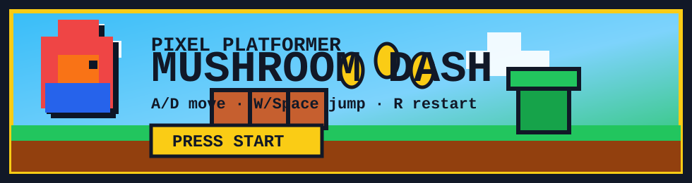

---

<h2>Live Dashboard</h2>

 
 

<picture>
  <source media="(prefers-color-scheme: dark)" srcset="https://skillicons.dev/icons?i=python,ts,js,react,vue,nodejs,fastapi,docker,linux,git,github,postgres,redis,pytorch,vscode,bash&theme=dark&perline=8" />
  <source media="(prefers-color-scheme: light)" srcset="https://skillicons.dev/icons?i=python,ts,js,react,vue,nodejs,fastapi,docker,linux,git,github,postgres,redis,pytorch,vscode,bash&theme=light&perline=8" />
  
</picture>

 
 

<table>
  <tr>
    <td width="50%" align="center">
      
    </td>
    <td width="50%" align="center">
      
    </td>
  </tr>
</table>

 

---

<h2>Mini Game Cartridge</h2>

<b>README cannot run JavaScript directly, so the cartridge opens a tiny pixel platformer on GitHub Pages.</b>

---

<table>
  <tr>
    <td width="52%">
      <h3>Signal</h3>
      

        I am a computer science grad student who likes AI agents, bot frameworks,
        tool calling, automation, and the kind of bugs that look haunted until
        you write the smallest failing test.
      

      <ul>
        <li>Currently building around: AstrBot, LLM tools, MCP, web automation.</li>
        <li>Favorite workflow: reproduce, isolate, patch, test, ship.</li>
        <li>Lab fuel: Python backends, TypeScript frontends, Docker boxes, and one very busy GPU.</li>
      </ul>
    </td>
    <td width="48%">
      <h3>Mode</h3>
      

        Small fixes, sharp tools, clean upstream PRs. If a bug can be reduced to
        a failing test, it is already halfway cooked.
      

    </td>
  </tr>
</table>

---

  
<b>Things I like shipping</b>

   
  <table>
    <tr>
      <td><b>Agent tooling</b></td>
      <td>Function calling, MCP, browser control, memory, multimodal bots.</td>
    </tr>
    <tr>
      <td><b>Backend patches</b></td>
      <td>Provider adapters, schema compatibility, async workflows, boring reliability.</td>
    </tr>
    <tr>
      <td><b>Frontend polish</b></td>
      <td>Dashboards that feel sharp, not default-template sad.</td>
    </tr>
    <tr>
      <td><b>Open source rhythm</b></td>
      <td>Small PRs, clear tests, no mystery meat diffs.</td>
    </tr>
  </table>

  
<b>Current quest log</b>

   
  <ul>
    <li>Make chat bots better at deciding when to speak, search, remember, and use tools.</li>
    <li>Connect practical MCP tools into everyday workflows.</li>
    <li>Keep learning how to turn messy production problems into clean upstream fixes.</li>
  </ul>

---

<picture>
  <source media="(prefers-color-scheme: dark)" srcset="https://raw.githubusercontent.com/bugkeep/bugkeep/output/github-contribution-grid-snake-dark.svg" />
  <source media="(prefers-color-scheme: light)" srcset="https://raw.githubusercontent.com/bugkeep/bugkeep/output/github-contribution-grid-snake.svg" />
  
</picture>

